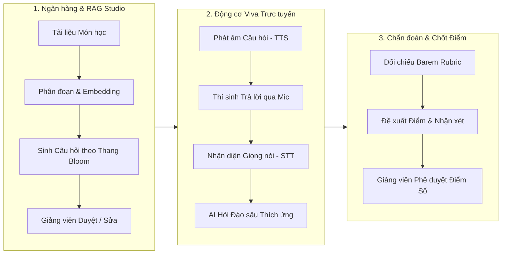
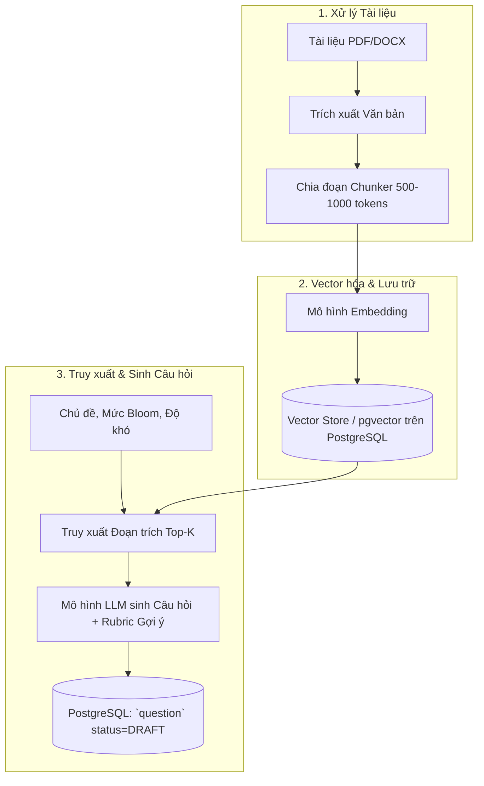

# AIVES — Đặc tả Kỹ thuật & Luồng Trí tuệ Nhân tạo (AI System Specification)

Tài liệu này tổng hợp toàn diện các yêu cầu nghiệp vụ, luồng vận hành và kiến trúc kỹ thuật của hệ thống Trí tuệ Nhân tạo (AI) trong **AI-powered Viva Exam System (AIVES)**, bao gồm 3 trụ cột cốt lõi: **RAG Studio (Sinh câu hỏi)**, **Viva Runtime Engine (Thi vấn đáp bằng giọng nói & Hỏi thích ứng)**, và **Diagnostic Grading Engine (Chấm điểm chẩn đoán Human-in-the-Loop)**.

---

## 1. Tổng quan 3 Phân hệ Năng lực AI

---

## 2. Phân hệ 1: RAG Studio — Sinh Câu hỏi Thi từ Giáo trình

### 2.1 Yêu cầu Nghiệp vụ (`AI-REQ-01`)
- **Mục tiêu:** Sinh câu hỏi thi vấn đáp chuẩn hóa bám sát giáo trình, slide bài giảng hoặc đề cương môn học (`course_document`).
- **Phân loại nhận thức:** Chuẩn hóa câu hỏi theo 6 cấp độ Thang đo nhận thức Bloom: `REMEMBER`, `UNDERSTAND`, `APPLY`, `ANALYZE`, `EVALUATE`, `CREATE`.
- **Ràng buộc an toàn:**
  - Câu hỏi do AI sinh ra bắt buộc khởi tạo với `status = 'DRAFT'` và `source_type = 'AI_GENERATED'`.
  - Tuyệt đối **KHÔNG** đưa vào đề thi nếu chưa có giảng viên phê duyệt (`reviewed_by IS NOT NULL`).

### 2.2 Quy trình Pipeline RAG

---

## 3. Phân hệ 2: Viva Runtime Engine — Phòng thi Vấn đáp Bằng Giọng nói

### 3.1 Chuyển Văn bản thành Giọng nói (Text-to-Speech - TTS) (`AI-REQ-02`)
- **Mô tả:** Giám khảo AI phát âm câu hỏi chính và câu hỏi phụ bằng giọng đọc tự nhiên, ngữ điệu rõ ràng, nhịp độ học thuật chuẩn mực.
- **Triển khai:** Hỗ trợ Web Speech API trên trình duyệt hoặc tích hợp dịch vụ TTS Cloud (OpenAI Audio / Google Cloud TTS / ElevenLabs).

### 3.2 Nhận diện Giọng nói Thí sinh thành Văn bản (Speech-to-Text - STT) (`AI-REQ-03`)
- **Mô tả:** Thu âm câu trả lời của thí sinh qua micro, truyền tải luồng âm thanh và nhận diện thành văn bản theo thời gian thực.
- **Dữ liệu lưu trữ (`transcript`):**
  - URL file ghi âm gốc (`student_audio_url`).
  - Văn bản nhận diện được (`stt_text`).
  - Thời lượng phát biểu (`answer_duration_seconds`) và chỉ số lưu loát (`fluency_score`).

### 3.3 Hỏi Đào sâu Thích ứng (Adaptive Follow-up Probing) (`AI-REQ-04`)
- **Mô tả:** Sau khi thí sinh phát biểu xong, AI đánh giá nhanh mức độ đầy đủ của câu trả lời.
  - Nếu câu trả lời đã bao quát tốt tiêu chí rubric: Hệ thống chuyển sang câu hỏi chính tiếp theo (`turn_type = 'MAIN'`).
  - Nếu câu trả lời mơ hồ hoặc còn thiếu ý bản chất: AI linh hoạt đặt câu hỏi phụ nhằm gợi mở hoặc đào sâu (`turn_type = 'FOLLOW_UP'`, liên kết qua `parent_turn_id`).
- **Quy tắc Kiểm soát Giới hạn:**
  - Giới hạn số câu hỏi phụ tối đa: Không vượt quá `exam.max_follow_up_per_q` (mặc định tối đa 2 câu hỏi phụ cho 1 câu hỏi chính).
  - Đồng hồ đếm ngược từng lượt (`time_limit_seconds`): Thí sinh phải hoàn thành phát biểu trước khi hết giờ.

---

## 4. Phân hệ 3: Diagnostic Grading Engine — Chẩn đoán & Chốt Điểm

### 4.1 Chẩn đoán Tự động Dựa trên Rubric (`AI-REQ-05`)
- Khi kết thúc ca thi, AI phân tích toàn bộ chuỗi lượt hỏi đáp đối chiếu với bảng tiêu chí `rubric_criterion` và từ khóa `expected_answer_keywords`.
- **Dữ liệu sinh ra trong bảng `ai_grading_suggestion`:**
  - Điểm số đề xuất (`suggested_score`).
  - Điểm mạnh thể hiện được (`strengths`).
  - Điểm yếu hoặc nhầm lẫn khái niệm (`weaknesses`).
  - Các ý quan trọng bị bỏ sót (`missing_points`).

### 4.2 Nguyên tắc Bất biến: Con người Quyết định (Human-in-the-Loop)
> [!IMPORTANT]
> **Giảng viên luôn là người duy nhất nắm quyền quyết định điểm số chính thức.**
> - Gợi ý của AI hoàn toàn mang tính chất **TƯ VẤN & TRỢ GIÚP**.
> - AI không bao giờ được phép tự động phê duyệt điểm chính thức.
> - Giảng viên mở bảng điều khiển chấm thi, nghe lại file ghi âm, đọc transcript, tham khảo gợi ý của AI, chỉnh sửa điểm số nếu cần và chính thức ký duyệt điểm (`final_grade.confirmed_by`).

---

## 5. Danh mục Công nghệ & Trạng thái Lựa chọn (Technology Stack)

| Phân hệ | Thành phần | Lựa chọn Đề xuất | Trạng thái |
| :--- | :--- | :--- | :--- |
| **LLM (Sinh câu hỏi & Chấm điểm)** | Reasoning & Text Gen | Google Gemini 1.5 Pro / OpenAI GPT-4o / Spring AI | *TBD — Đang chọn lựa* |
| **Embedding & Vector Search** | Vector Database | `pgvector` trực tiếp trên PostgreSQL 18 | *Khuyến nghị (Tối ưu hạ tầng)* |
| **Speech-to-Text (STT)** | Nhận diện giọng nói | Web Speech API (Client) + Whisper API (Server verify) | *TBD — Đang chọn lựa* |
| **Text-to-Speech (TTS)** | Đọc câu hỏi | Web Speech Synthesis API / Google TTS / OpenAI TTS | *TBD — Đang chọn lựa* |
