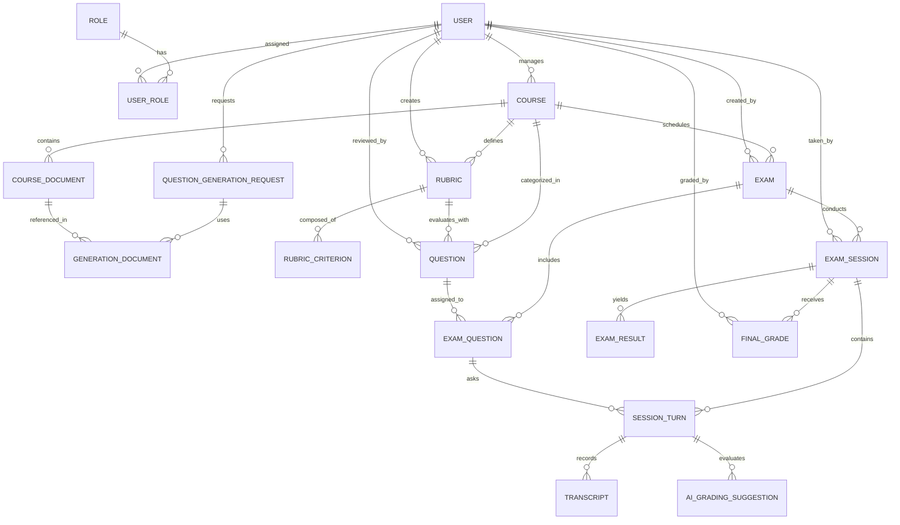

# AIVES — Đặc tả Cơ sở Dữ liệu Vật lý & Phân tích Khoảng cách JPA (Physical ERD & Gap)

Tài liệu này đặc tả cấu trúc cơ sở dữ liệu vật lý chính thức của hệ thống **AI-powered Viva Exam System (AIVES)** dựa trên file DDL `aives_physical.sql` và mô hình DBML. Đồng thời, tài liệu cung cấp phân tích khoảng cách chi tiết (Gap Analysis) giữa các Entity JPA hiện có và schema chuẩn 18 bảng.

---

## 1. Sơ đồ Physical ERD Chính thức (18 Bảng)

Cấu trúc cơ sở dữ liệu chuẩn gồm **18 bảng quan hệ** được tổ chức thành 4 phân hệ chức năng:

---

## 2. Danh mục 18 Bảng Dữ liệu Chuẩn

| # | Tên bảng | Mục đích / Nghiệp vụ | Khóa chính (PK) | Khóa ngoại (FK) |
|---|---|---|---|---|
| 1 | `role` | Danh mục vai trò hệ thống (`ADMIN`, `LECTURER`, `STUDENT`) | `role_id` (INT) | Không |
| 2 | `user` | Tài khoản và mật khẩu người dùng | `user_id` (BIGINT) | Không |
| 3 | `user_role` | Bảng trung gian gán vai trò cho người dùng | (`user_id`, `role_id`) | `user.user_id`, `role.role_id` |
| 4 | `course` | Môn học / Khóa học do giảng viên phụ trách | `course_id` (BIGINT) | `user.user_id` (`managed_by`) |
| 5 | `course_document` | Tài liệu học tập (slide, giáo trình) của môn học | `document_id` (BIGINT) | `course.course_id` |
| 6 | `question_generation_request` | Nhật ký các yêu cầu sinh câu hỏi bằng AI RAG | `request_id` (BIGINT) | `user.user_id` (`requested_by`) |
| 7 | `generation_document` | Bảng liên kết yêu cầu sinh câu hỏi với tài liệu nguồn | (`request_id`, `document_id`) | `question_generation_request.request_id`, `course_document.document_id` |
| 8 | `rubric` | Bộ tiêu chí chấm điểm chuẩn (Rubric container) | `rubric_id` (BIGINT) | Không |
| 9 | `rubric_criterion` | Các mục tiêu chí con kèm điểm số và từ khóa mong đợi | `criterion_id` (BIGINT) | `rubric.rubric_id` |
| 10 | `question` | Ngân hàng câu hỏi thi (Dự thảo/Đã duyệt, AI/Thủ công) | `question_id` (BIGINT) | `course.course_id`, `rubric.rubric_id`, `question_generation_request.request_id` |
| 11 | `exam` | Cấu hình kỳ thi vấn đáp | `exam_id` (BIGINT) | `course.course_id` |
| 12 | `exam_question` | Danh sách câu hỏi gán vào đề thi kèm thứ tự hỏi | (`exam_id`, `question_id`) | `exam.exam_id`, `question.question_id` |
| 13 | `exam_session` | Ca thi vấn đáp của từng sinh viên | `session_id` (BIGINT) | `exam.exam_id`, `user.user_id` (`student_id`) |
| 14 | `session_turn` | Từng lượt hỏi - đáp tương tác trong ca thi | `turn_id` (BIGINT) | `exam_session.session_id`, `question.question_id`, `session_turn.turn_id` |
| 15 | `transcript` | File ghi âm và văn bản nhận diện giọng nói (STT) | `transcript_id` (BIGINT) | `session_turn.turn_id` (1:1) |
| 16 | `ai_grading_suggestion` | Điểm gợi ý và phân tích điểm mạnh/yếu của AI | `suggestion_id` (BIGINT) | `session_turn.turn_id` (1:1) |
| 17 | `final_grade` | Điểm chính thức và nhận xét do giảng viên chốt | `grade_id` (BIGINT) | `exam_session.session_id` (1:1), `user.user_id` (`confirmed_by`) |
| 18 | `exam_result` | Chỉ số tổng hợp ca thi (trạng thái, tổng lượt, thời lượng) | `result_id` (BIGINT) | `exam_session.session_id` (1:1) |

---

## 3. PHÂN TÍCH KHOẢNG CÁCH (CURRENT JPA ↔ OFFICIAL DATABASE GAP)

Phần này kiểm toán và đối chiếu chi tiết giữa **Mã nguồn Entity JPA hiện có** và **Schema Cơ sở Dữ liệu Chuẩn**.

### 3.1 Tóm tắt Tổng quan
- **Số bảng trong thiết kế chuẩn:** 18 bảng.
- **Số bảng đang được mô phỏng bởi JPA hiện tại:** 6 bảng (`User`, `Subject`, `Question`, `QuestionRubric`, `Exam`, `ExamSession`).
- **Số bảng chuẩn còn thiếu hoàn toàn trong JPA:** 12 bảng (`role`, `user_role`, `course_document`, `question_generation_request`, `generation_document`, `rubric`, `rubric_criterion`, `exam_question`, `session_turn`, `transcript`, `ai_grading_suggestion`, `exam_result`, `final_grade`).

---

### 3.2 Đối chiếu Chi tiết từng Nhóm Bảng

#### A. Phân hệ Định danh & Phân quyền
1. **Bảng `role` & `user_role`**:
   - *Chuẩn thiết kế:* Bảng `role` chuẩn hóa với liên kết N:N qua bảng trung gian `user_role`. Các vai trò: `ADMIN`, `LECTURER`, `STUDENT`.
   - *JPA hiện tại (`User.java`):* Lưu vai trò thành cột chuỗi trực tiếp (`@Enumerated(EnumType.STRING) private Role role;`) trên bảng `users`. Bảng `role` và `user_role` chưa có.
2. **Bảng `user`**:
   - *Chuẩn thiết kế:* Tên bảng `user`, PK `user_id` (`BIGINT`), các cột `email`, `password_hash`, `full_name`, `is_active`, `created_at`.
   - *JPA hiện tại (`User.java`):* Tên bảng `users`, PK kiểu `UUID`, thiếu `password_hash` (chưa có trường mật khẩu), thiếu cờ `is_active`.

#### B. Phân hệ Môn học & Tài liệu RAG
3. **Bảng `course`**:
   - *Chuẩn thiết kế:* Tên bảng `course`, PK `course_id` (`BIGINT`), `course_code`, `course_name`, FK `managed_by` trỏ tới `user.user_id`.
   - *JPA hiện tại (`Subject.java`):* Tên bảng `subjects`, PK kiểu `UUID`, tên cột `code`, `name`, `description`. Chưa có liên kết `managed_by` với giảng viên.
4. **Bảng `course_document`**:
   - *Chuẩn thiết kế:* Bảng lưu file tài liệu môn học (`document_id`, `course_id`, `file_name`, `file_url`, `uploaded_at`).
   - *JPA hiện tại:* **Chưa có Entity**.

#### C. Phân hệ Sinh câu hỏi AI qua RAG
5. **Bảng `question_generation_request` & `generation_document`**:
   - *Chuẩn thiết kế:* Theo dõi trạng thái sinh câu hỏi (`PROCESSING`, `COMPLETED`, `FAILED`), tham số Bloom và tài liệu tham chiếu.
   - *JPA hiện tại:* **Chưa có Entity**.

#### D. Phân hệ Ngân hàng Câu hỏi & Barem điểm (Rubric)
6. **Bảng `rubric` & `rubric_criterion`**:
   - *Chuẩn thiết kế:* Mô hình 2 cấp độc lập (`rubric` -> 1:N -> `rubric_criterion`). Cho phép một rubric dùng chung cho nhiều câu hỏi.
   - *JPA hiện tại (`QuestionRubric.java`):* Là một bảng con gắn chết trực tiếp vào từng câu hỏi (`question_id`). Chưa có thực thể Rubric độc lập dùng chung.
7. **Bảng `question`**:
   - *Chuẩn thiết kế:* Tên bảng `question`, PK `question_id` (`BIGINT`), FK `course_id`, FK `rubric_id`, FK `generation_request_id`. Các trường: `question_text`, `bloom_level`, `difficulty`, `source_type`, `status`.
   - *JPA hiện tại (`Question.java`):* PK kiểu `UUID`, FK `subject_id`. Cột `content`, `sampleAnswer`. Thiếu FK `rubric_id`, thiếu liên kết với yêu cầu RAG.

#### E. Phân hệ Cấu hình Đề thi
8. **Bảng `exam`**:
   - *Chuẩn thiết kế:* Bảng `exam`, PK `exam_id` (`BIGINT`), `title`, FK `course_id`, `duration_minutes`, `max_follow_up_per_q`.
   - *JPA hiện tại (`Exam.java`):* PK kiểu `UUID`, thiếu liên kết danh sách câu hỏi.
9. **Bảng `exam_question`**:
   - *Chuẩn thiết kế:* Bảng trung gian gán câu hỏi vào đề thi kèm thứ tự hỏi `question_order`.
   - *JPA hiện tại:* **Chưa có Entity**.

#### F. Phân hệ Ca thi Vấn đáp & Chấm điểm
10. **Bảng `exam_session`**:
    - *Chuẩn thiết kế:* PK `session_id` (`BIGINT`), FK `exam_id`, FK `student_id`, trạng thái (`ONGOING`, `COMPLETED`, `CANCELLED`).
    - *JPA hiện tại (`ExamSession.java`):* PK kiểu `UUID`, nhúng trực tiếp các cột điểm số thay vì tách riêng.
11. **Bảng `session_turn`**:
    - *Chuẩn thiết kế:* Ghi nhận từng lượt hỏi đáp (`turn_type`: `MAIN`, `FOLLOW_UP`), có quan hệ phân cấp cây `parent_turn_id`.
    - *JPA hiện tại:* **Chưa có Entity**.
12. **Bảng `transcript`**:
    - *Chuẩn thiết kế:* Lưu file ghi âm `student_audio_url`, văn bản `stt_text` và điểm lưu loát.
    - *JPA hiện tại:* **Chưa có Entity**.
13. **Bảng `ai_grading_suggestion`**:
    - *Chuẩn thiết kế:* Lưu gợi ý điểm số, điểm mạnh, điểm yếu, ý còn thiếu của AI cho từng lượt thi.
    - *JPA hiện tại:* **Chưa có Entity**.
14. **Bảng `final_grade` & `exam_result`**:
    - *Chuẩn thiết kế:* Lưu điểm số chính thức do giảng viên ký duyệt (`final_grade`) và số liệu thống kê thời lượng ca thi (`exam_result`).
    - *JPA hiện tại:* **Chưa có Entity**.

---

## 4. Khuyến nghị Thực hiện
Không tự ý sửa đổi code Java hiện tại khi chưa có quyết định thống nhất từ nhóm. Trong **Giai đoạn 1 (Phase 1: Database Migration & Authentication)**:
1. Thống nhất dứt điểm chiến lược khóa chính (ADR-01: `BIGINT` vs `UUID`).
2. Thiết lập công cụ Flyway chạy script DDL từ `aives_physical.sql`.
3. Cập nhật và sinh mới đầy đủ 18 Entity JPA khớp chính xác 100% với schema chuẩn.

---

# AIVES — Từ điển Dữ liệu Cơ sở Dữ liệu (Data Dictionary)

Tài liệu này đặc tả chi tiết toàn bộ các bảng, tên cột, kiểu dữ liệu, ràng buộc chấp nhận giá trị rỗng (nullability), khóa chính (PK), khóa ngoại (FK), giá trị mặc định và ý nghĩa nghiệp vụ của 18 bảng trong cơ sở dữ liệu vật lý chính thức của **AIVES** (`aives_physical.sql`).

---

## 1. Bảng: `role`
Lưu trữ danh mục các vai trò bảo mật được định nghĩa sẵn trong hệ thống.

| Tên cột | Kiểu dữ liệu | Nullable | PK / FK | Mặc định | Mô tả nghiệp vụ | Bảng liên quan |
|---|---|---|---|---|---|---|
| `role_id` | `SERIAL` (`INT`) | Không | **PK** | auto-increment | Định danh duy nhất cho từng vai trò | - |
| `role_name` | `role_enum` (`'ADMIN'`, `'LECTURER'`, `'STUDENT'`) | Không | Duy nhất | - | Tên vai trò phân quyền | - |

---

## 2. Bảng: `user`
Lưu trữ thông tin tài khoản người dùng, chứng thực và trạng thái hoạt động.

| Tên cột | Kiểu dữ liệu | Nullable | PK / FK | Mặc định | Mô tả nghiệp vụ | Bảng liên quan |
|---|---|---|---|---|---|---|
| `user_id` | `BIGSERIAL` | Không | **PK** | auto-increment | Khóa chính định danh người dùng | - |
| `email` | `VARCHAR(255)` | Không | Duy nhất | - | Email đăng nhập của người dùng | - |
| `password_hash` | `VARCHAR(255)` | Không | - | - | Chuỗi băm mật khẩu mã hóa BCrypt | - |
| `full_name` | `VARCHAR(100)` | Không | - | - | Họ và tên đầy đủ | - |
| `is_active` | `BOOLEAN` | Không | - | `TRUE` | Cờ trạng thái kích hoạt tài khoản | - |
| `created_at` | `TIMESTAMP` | Không | - | `CURRENT_TIMESTAMP` | Thời điểm tạo tài khoản | - |

---

## 3. Bảng: `user_role`
Bảng trung gian liên kết người dùng với một hoặc nhiều vai trò tương ứng (N:N).

| Tên cột | Kiểu dữ liệu | Nullable | PK / FK | Mặc định | Mô tả nghiệp vụ | Bảng liên quan |
|---|---|---|---|---|---|---|
| `user_id` | `BIGINT` | Không | **PK, FK** | - | Khóa ngoại tham chiếu đến người dùng | `user(user_id)` ON DELETE CASCADE |
| `role_id` | `INT` | Không | **PK, FK** | - | Khóa ngoại tham chiếu đến vai trò | `role(role_id)` ON DELETE CASCADE |

---

## 4. Bảng: `course`
Lưu trữ thông tin môn học / khóa học do giảng viên phụ trách quản lý.

| Tên cột | Kiểu dữ liệu | Nullable | PK / FK | Mặc định | Mô tả nghiệp vụ | Bảng liên quan |
|---|---|---|---|---|---|---|
| `course_id` | `BIGSERIAL` | Không | **PK** | auto-increment | Khóa chính môn học | - |
| `course_code` | `VARCHAR(20)` | Không | Duy nhất | - | Mã môn học (ví dụ: SWD392, PRN231) | - |
| `course_name` | `VARCHAR(255)` | Không | - | - | Tên đầy đủ của môn học | - |
| `managed_by` | `BIGINT` | Không | **FK** | - | Giảng viên phụ trách môn học | `user(user_id)` |
| `created_at` | `TIMESTAMP` | Không | - | `CURRENT_TIMESTAMP` | Thời điểm tạo môn học | - |

---

## 5. Bảng: `course_document`
Lưu trữ tài liệu học tập tham khảo (đề cương, slide, giáo trình) phục vụ RAG sinh câu hỏi.

| Tên cột | Kiểu dữ liệu | Nullable | PK / FK | Mặc định | Mô tả nghiệp vụ | Bảng liên quan |
|---|---|---|---|---|---|---|
| `document_id` | `BIGSERIAL` | Không | **PK** | auto-increment | Khóa chính tài liệu | - |
| `course_id` | `BIGINT` | Không | **FK** | - | Môn học chứa tài liệu này | `course(course_id)` ON DELETE CASCADE |
| `file_name` | `VARCHAR(255)` | Không | - | - | Tên file gốc tải lên | - |
| `file_url` | `VARCHAR(1000)` | Không | - | - | Đường dẫn / URL lưu trữ file vật lý | - |
| `uploaded_at` | `TIMESTAMP` | Không | - | `CURRENT_TIMESTAMP` | Thời điểm tải file lên hệ thống | - |

---

## 6. Bảng: `question_generation_request`
Theo dõi các yêu cầu sinh câu hỏi tự động bằng AI qua RAG.

| Tên cột | Kiểu dữ liệu | Nullable | PK / FK | Mặc định | Mô tả nghiệp vụ | Bảng liên quan |
|---|---|---|---|---|---|---|
| `request_id` | `BIGSERIAL` | Không | **PK** | auto-increment | Khóa chính yêu cầu sinh câu hỏi | - |
| `course_id` | `BIGINT` | Không | **FK** | - | Môn học cần sinh câu hỏi | `course(course_id)` |
| `requested_by` | `BIGINT` | Không | **FK** | - | Giảng viên khởi tạo yêu cầu | `user(user_id)` |
| `topic` | `VARCHAR(255)` | Không | - | - | Chủ đề trọng tâm cần sinh câu hỏi | - |
| `bloom_level` | `bloom_level_enum` | Có | - | - | Mức độ nhận thức theo Thang đo Bloom | - |
| `target_count` | `INT` | Không | - | `5` | Số lượng câu hỏi mục tiêu cần sinh | - |
| `status` | `VARCHAR(50)` | Không | - | `'PROCESSING'` | Trạng thái (`PROCESSING`, `COMPLETED`, `FAILED`) | - |
| `created_at` | `TIMESTAMP` | Không | - | `CURRENT_TIMESTAMP` | Thời điểm tạo yêu cầu | - |

---

## 7. Bảng: `generation_document`
Bảng trung gian liên kết yêu cầu sinh câu hỏi với một hoặc nhiều tài liệu tham khảo nguồn.

| Tên cột | Kiểu dữ liệu | Nullable | PK / FK | Mặc định | Mô tả nghiệp vụ | Bảng liên quan |
|---|---|---|---|---|---|---|
| `request_id` | `BIGINT` | Không | **PK, FK** | - | Mã yêu cầu sinh câu hỏi | `question_generation_request(request_id)` ON DELETE CASCADE |
| `document_id` | `BIGINT` | Không | **PK, FK** | - | Mã tài liệu học tập được dùng | `course_document(document_id)` ON DELETE CASCADE |

---

## 8. Bảng: `rubric`
Định nghĩa bộ tiêu chí chấm điểm chuẩn (Rubric container) có thể tái sử dụng cho nhiều câu hỏi.

| Tên cột | Kiểu dữ liệu | Nullable | PK / FK | Mặc định | Mô tả nghiệp vụ | Bảng liên quan |
|---|---|---|---|---|---|---|
| `rubric_id` | `BIGSERIAL` | Không | **PK** | auto-increment | Khóa chính bộ rubric | - |
| `name` | `VARCHAR(255)` | Không | - | - | Tên bộ rubric | - |
| `description` | `TEXT` | Có | - | - | Mô tả phạm vi và hướng dẫn chấm điểm | - |
| `created_at` | `TIMESTAMP` | Không | - | `CURRENT_TIMESTAMP` | Thời điểm tạo rubric | - |

---

## 9. Bảng: `rubric_criterion`
Các tiêu chí con cụ thể, thang điểm tối đa và từ khóa mong đợi thuộc một rubric.

| Tên cột | Kiểu dữ liệu | Nullable | PK / FK | Mặc định | Mô tả nghiệp vụ | Bảng liên quan |
|---|---|---|---|---|---|---|
| `criterion_id` | `BIGSERIAL` | Không | **PK** | auto-increment | Khóa chính tiêu chí con | - |
| `rubric_id` | `BIGINT` | Không | **FK** | - | Khóa ngoại tham chiếu bộ rubric cha | `rubric(rubric_id)` ON DELETE CASCADE |
| `criterion_name` | `VARCHAR(255)` | Không | - | - | Tên tiêu chí đánh giá | - |
| `max_score` | `DECIMAL(5,2)` | Không | - | - | Điểm số tối đa cho tiêu chí này | - |
| `expected_answer_keywords` | `TEXT` | Có | - | - | Từ khóa kiến thức bắt buộc thí sinh phải trả lời | - |

---

## 10. Bảng: `question`
Ngân hàng câu hỏi thi vấn đáp trung tâm (bao gồm câu hỏi soạn thủ công và do AI sinh).

| Tên cột | Kiểu dữ liệu | Nullable | PK / FK | Mặc định | Mô tả nghiệp vụ | Bảng liên quan |
|---|---|---|---|---|---|---|
| `question_id` | `BIGSERIAL` | Không | **PK** | auto-increment | Khóa chính câu hỏi | - |
| `course_id` | `BIGINT` | Không | **FK** | - | Môn học chứa câu hỏi này | `course(course_id)` |
| `rubric_id` | `BIGINT` | Không | **FK** | - | Bộ tiêu chí rubric dùng để chấm điểm | `rubric(rubric_id)` |
| `generation_request_id`| `BIGINT` | Có | **FK** | - | Yêu cầu RAG đã tạo ra câu hỏi này (nếu do AI sinh) | `question_generation_request(request_id)` ON DELETE SET NULL |
| `question_text` | `TEXT` | Không | - | - | Nội dung văn bản câu hỏi vấn đáp | - |
| `sample_answer` | `TEXT` | Có | - | - | **Đáp án mẫu / dàn ý** cần trả lời — làm căn cứ để AI đối chiếu khi chấm điểm | - |
| `bloom_level` | `bloom_level_enum` | Không | - | - | Cấp độ nhận thức Thang đo Bloom | - |
| `difficulty` | `SMALLINT` | Không | - | `1` | Độ khó (1: Dễ, 2: Trung bình, 3: Khó) | - |
| `source_type` | `question_source_enum` | Không | - | - | Nguồn tạo (`MANUAL`, `IMPORTED`, `AI_GENERATED`) | - |
| `status` | `question_status_enum` | Không | - | `'DRAFT'` | Trạng thái duyệt (`DRAFT`, `PENDING_REVIEW`, `APPROVED`, `REJECTED`) | - |
| `reviewed_by` | `BIGINT` | Có | **FK** | `NULL` | Giảng viên đã phê duyệt câu hỏi (NULL nếu chưa duyệt) | `user(user_id)` ON DELETE SET NULL |
| `reviewed_at` | `TIMESTAMP` | Có | - | `NULL` | Thời điểm giảng viên phê duyệt (NULL nếu chưa duyệt) | - |
| `created_at` | `TIMESTAMP` | Không | - | `CURRENT_TIMESTAMP` | Thời điểm tạo câu hỏi | - |

---

## 11. Bảng: `exam`
Cấu hình đề thi / kỳ thi vấn đáp.

| Tên cột | Kiểu dữ liệu | Nullable | PK / FK | Mặc định | Mô tả nghiệp vụ | Bảng liên quan |
|---|---|---|---|---|---|---|
| `exam_id` | `BIGSERIAL` | Không | **PK** | auto-increment | Khóa chính kỳ thi | - |
| `course_id` | `BIGINT` | Không | **FK** | - | Môn học tổ chức kỳ thi | `course(course_id)` |
| `title` | `VARCHAR(255)` | Không | - | - | Tên kỳ thi | - |
| `duration_minutes` | `INT` | Không | - | - | Thời lượng tối đa của một ca thi (phút) | - |
| `max_follow_up_per_q` | `INT` | Không | - | `2` | Số câu hỏi phụ tối đa cho mỗi câu hỏi chính | - |
| `created_at` | `TIMESTAMP` | Không | - | `CURRENT_TIMESTAMP` | Thời điểm tạo kỳ thi | - |

---

## 12. Bảng: `exam_question`
Bảng trung gian liên kết danh sách câu hỏi vào đề thi kèm theo thứ tự hỏi cụ thể.

| Tên cột | Kiểu dữ liệu | Nullable | PK / FK | Mặc định | Mô tả nghiệp vụ | Bảng liên quan |
|---|---|---|---|---|---|---|
| `exam_id` | `BIGINT` | Không | **PK, FK** | - | Khóa ngoại tham chiếu kỳ thi | `exam(exam_id)` ON DELETE CASCADE |
| `question_id` | `BIGINT` | Không | **PK, FK** | - | Khóa ngoại tham chiếu câu hỏi | `question(question_id)` ON DELETE CASCADE |
| `question_order` | `INT` | Không | - | - | Thứ tự xuất hiện trong ca thi vấn đáp | - |

---

## 13. Bảng: `exam_session`
Lưu trữ thông tin ca thi vấn đáp thực tế của từng thí sinh.

| Tên cột | Kiểu dữ liệu | Nullable | PK / FK | Mặc định | Mô tả nghiệp vụ | Bảng liên quan |
|---|---|---|---|---|---|---|
| `session_id` | `BIGSERIAL` | Không | **PK** | auto-increment | Khóa chính ca thi | - |
| `exam_id` | `BIGINT` | Không | **FK** | - | Đề thi của ca thi này | `exam(exam_id)` |
| `student_id` | `BIGINT` | Không | **FK** | - | Sinh viên tham gia ca thi | `user(user_id)` |
| `started_at` | `TIMESTAMP` | Không | - | `CURRENT_TIMESTAMP` | Thời điểm bắt đầu làm bài | - |
| `ended_at` | `TIMESTAMP` | Có | - | - | Thời điểm kết thúc ca thi | - |
| `status` | `VARCHAR(50)` | Không | - | `'ONGOING'` | Trạng thái (`ONGOING`, `COMPLETED`, `CANCELLED`) | - |

---

## 14. Bảng: `session_turn`
Ghi nhận từng lượt tương tác hỏi - đáp cụ thể trong ca thi.

| Tên cột | Kiểu dữ liệu | Nullable | PK / FK | Mặc định | Mô tả nghiệp vụ | Bảng liên quan |
|---|---|---|---|---|---|---|
| `turn_id` | `BIGSERIAL` | Không | **PK** | auto-increment | Khóa chính lượt thi | - |
| `session_id` | `BIGINT` | Không | **FK** | - | Ca thi chứa lượt hỏi này | `exam_session(session_id)` ON DELETE CASCADE |
| `question_id` | `BIGINT` | Có | **FK** | - | Câu hỏi gốc trong ngân hàng (rỗng nếu là câu hỏi phụ AI tự sinh) | `question(question_id)` |
| `parent_turn_id` | `BIGINT` | Có | **FK** | - | Khóa ngoại trỏ về lượt chính nếu đây là câu hỏi phụ thích ứng | `session_turn(turn_id)` ON DELETE CASCADE |
| `turn_type` | `turn_type_enum` | Không | - | - | Loại lượt (`MAIN`, `FOLLOW_UP`) | - |
| `question_text` | `TEXT` | Không | - | - | Nội dung câu hỏi hệ thống đã đặt ra | - |
| `sequence_number` | `INT` | Không | - | - | Thứ tự lượt hỏi tuần tự trong ca thi | - |
| `time_limit_seconds` | `INT` | Không | - | - | Thời gian cho phép trả lời đếm ngược (giây) | - |
| `created_at` | `TIMESTAMP` | Không | - | `CURRENT_TIMESTAMP` | Thời điểm bắt đầu lượt hỏi | - |

---

## 15. Bảng: `transcript`
Lưu trữ file âm thanh giọng nói và văn bản nhận diện STT cho từng lượt trả lời.

| Tên cột | Kiểu dữ liệu | Nullable | PK / FK | Mặc định | Mô tả nghiệp vụ | Bảng liên quan |
|---|---|---|---|---|---|---|
| `transcript_id` | `BIGSERIAL` | Không | **PK** | auto-increment | Khóa chính transcript | - |
| `turn_id` | `BIGINT` | Không | **FK, Duy nhất** | - | Lượt thi tương ứng (quan hệ 1:1) | `session_turn(turn_id)` ON DELETE CASCADE |
| `student_audio_url` | `VARCHAR(1000)` | Có | - | - | Đường dẫn / URL lưu file ghi âm giọng nói thí sinh | - |
| `stt_text` | `TEXT` | Không | - | - | Nội dung văn bản nhận diện từ giọng nói thí sinh | - |
| `answer_duration_seconds` | `INT` | Có | - | - | Thời gian thực tế sinh viên phát biểu (giây) | - |
| `fluency_score` | `DECIMAL(5,2)` | Có | - | - | Điểm đánh giá độ lưu loát khi phát biểu | - |
| `created_at` | `TIMESTAMP` | Không | - | `CURRENT_TIMESTAMP` | Thời điểm lưu văn bản transcript | - |

---

## 16. Bảng: `ai_grading_suggestion`
Lưu trữ đánh giá chẩn đoán và mức điểm đề xuất của AI cho từng lượt trả lời.

| Tên cột | Kiểu dữ liệu | Nullable | PK / FK | Mặc định | Mô tả nghiệp vụ | Bảng liên quan |
|---|---|---|---|---|---|---|
| `suggestion_id` | `BIGSERIAL` | Không | **PK** | auto-increment | Khóa chính gợi ý chấm điểm | - |
| `turn_id` | `BIGINT` | Không | **FK, Duy nhất** | - | Lượt thi tương ứng (quan hệ 1:1) | `session_turn(turn_id)` ON DELETE CASCADE |
| `suggested_score` | `DECIMAL(5,2)` | Không | - | - | Điểm số đề xuất từ động cơ AI | - |
| `strengths` | `TEXT` | Có | - | - | Những điểm trả lời chính xác, thuyết phục của thí sinh | - |
| `weaknesses` | `TEXT` | Có | - | - | Những lỗi sai, lập luận chưa chính xác hoặc mơ hồ | - |
| `missing_points` | `TEXT` | Có | - | - | Các từ khóa kiến thức bắt buộc hoặc ý cốt lõi bị bỏ sót | - |
| `generated_at` | `TIMESTAMP` | Không | - | `CURRENT_TIMESTAMP` | Thời điểm AI tạo báo cáo đánh giá | - |

---

## 17. Bảng: `final_grade`
Điểm số chính thức và nhận xét sư phạm do giảng viên phê duyệt và công bố.

| Tên cột | Kiểu dữ liệu | Nullable | PK / FK | Mặc định | Mô tả nghiệp vụ | Bảng liên quan |
|---|---|---|---|---|---|---|
| `grade_id` | `BIGSERIAL` | Không | **PK** | auto-increment | Khóa chính điểm số chính thức | - |
| `session_id` | `BIGINT` | Không | **FK, Duy nhất** | - | Ca thi được chốt điểm (quan hệ 1:1) | `exam_session(session_id)` ON DELETE CASCADE |
| `confirmed_by` | `BIGINT` | Không | **FK** | - | Giảng viên thẩm định và ký duyệt điểm | `user(user_id)` |
| `final_score` | `DECIMAL(5,2)` | Không | - | - | Điểm số chính thức cuối cùng của sinh viên | - |
| `lecturer_feedback` | `TEXT` | Có | - | - | Nhận xét chuyên môn và định hướng sư phạm của giảng viên | - |
| `confirmed_at` | `TIMESTAMP` | Không | - | `CURRENT_TIMESTAMP` | Thời điểm công bố điểm chính thức | - |

---

## 18. Bảng: `exam_result`
Chỉ số tổng hợp và trạng thái kết thúc ca thi vấn đáp.

| Tên cột | Kiểu dữ liệu | Nullable | PK / FK | Mặc định | Mô tả nghiệp vụ | Bảng liên quan |
|---|---|---|---|---|---|---|
| `result_id` | `BIGSERIAL` | Không | **PK** | auto-increment | Khóa chính kết quả tổng quan | - |
| `session_id` | `BIGINT` | Không | **FK, Duy nhất** | - | Ca thi tương ứng (quan hệ 1:1) | `exam_session(session_id)` ON DELETE CASCADE |
| `completion_status` | `VARCHAR(50)` | Không | - | - | Trạng thái hoàn thành (ví dụ: `COMPLETED`, `TIME_EXPIRED`) | - |
| `total_turns` | `INT` | Không | - | - | Tổng số lượt hỏi đáp đã diễn ra (câu hỏi chính + câu hỏi phụ) | - |
| `overall_duration_seconds` | `INT` | Có | - | - | Tổng thời gian thực tế đã thi (giây) | - |
| `calculated_at` | `TIMESTAMP` | Không | - | `CURRENT_TIMESTAMP` | Thời điểm hoàn tất tính toán kết quả | - |
