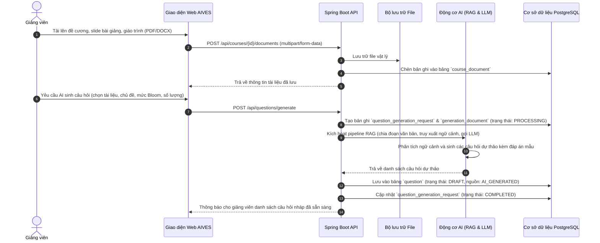
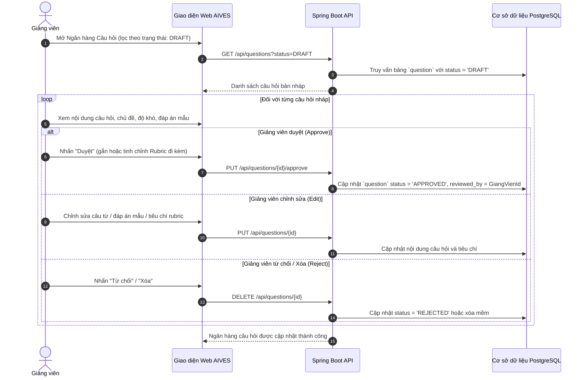
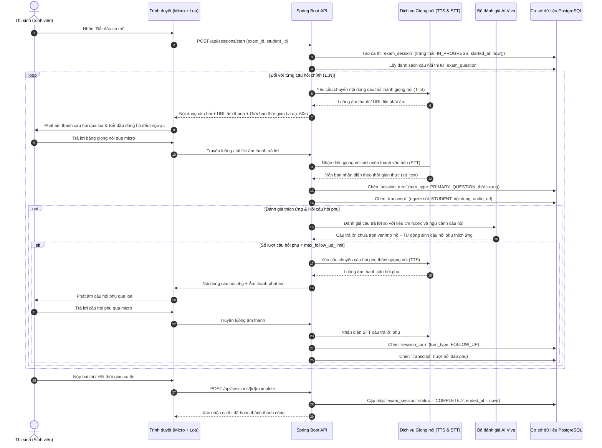
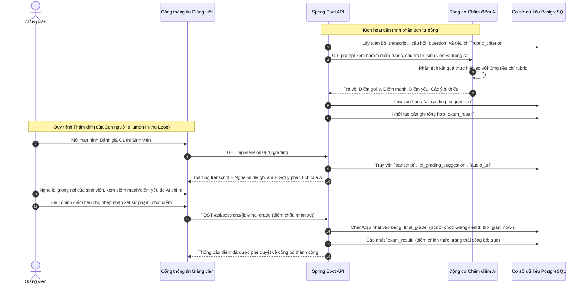
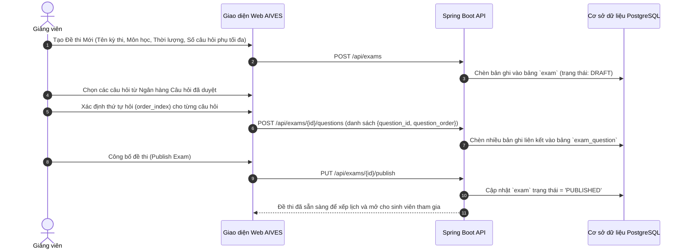

# AIVES — Đặc tả Ca sử dụng (Use Case Specifications)

**Tài liệu Nguồn:** `UseCase.drawio.png`, `Swimlane.drawio.png`.

---

## UC-01: Tải lên Tài liệu Môn học (Upload Study Material)
- **Mã định danh:** UC-01
- **Tên ca sử dụng:** Tải lên Tài liệu Môn học
- **Tác nhân chính:** Giảng viên (Lecturer)
- **Tác nhân / Hệ thống hỗ trợ:** Hệ thống Lưu trữ AIVES
- **Điều kiện tiên quyết:** Giảng viên đã đăng nhập và được phân công quản lý môn học đó.
- **Luồng sự kiện chính:**
  1. Giảng viên truy cập mục Quản lý Môn học và chọn môn học tương ứng.
  2. Giảng viên chọn một hoặc nhiều file tài liệu (PDF, DOCX) từ máy tính cá nhân.
  3. Giảng viên nhấn nút "Tải lên" (Upload).
  4. Hệ thống kiểm tra dung lượng và định dạng file, lưu trữ file vật lý và tạo bản ghi trong bảng `course_document`.
  5. Hệ thống thông báo tải lên thành công và hiển thị tài liệu trong danh sách của môn học.
- **Luồng sự kiện thay thế:** Không có.
- **Luồng sự kiện ngoại lệ:**
  - 4a. Định dạng file không hợp lệ hoặc dung lượng vượt quá giới hạn -> Hệ thống báo lỗi và hủy quá trình tải lên.
- **Điều kiện sau:** Tài liệu được liên kết với môn học và sẵn sàng phục vụ cho tính năng RAG sinh câu hỏi.

---

## UC-02: Sinh Câu hỏi bằng AI qua RAG (Generate via AI)
- **Mã định danh:** UC-02
- **Tên ca sử dụng:** Sinh Câu hỏi Tự động qua RAG (Generate via AI)
- **Tác nhân chính:** Giảng viên
- **Tác nhân / Hệ thống hỗ trợ:** Hệ thống AIVES, Động cơ AI bên ngoài (External AI Engine)
- **Điều kiện tiên quyết:** Môn học đã có ít nhất một tài liệu học tập được tải lên.
- **Luồng sự kiện chính:**
  1. Giảng viên chọn chức năng "Sinh câu hỏi bằng AI".
  2. Giảng viên chọn một hoặc nhiều tài liệu học tập làm căn cứ kiến thức (`generation_document`).
  3. Giảng viên thiết lập chủ đề (topic), mức độ nhận thức theo Thang đo Bloom và số lượng câu hỏi mong muốn (mặc định 5 câu).
  4. Giảng viên gửi yêu cầu -> Hệ thống tạo bản ghi `question_generation_request` với trạng thái `PROCESSING`.
  5. Hệ thống truy xuất các đoạn trích liên quan từ tài liệu và gửi prompt đến Động cơ AI.
  6. Động cơ AI sinh các câu hỏi dự thảo kèm đáp án mẫu và tiêu chí chấm điểm gợi ý.
  7. Hệ thống lưu câu hỏi vào cơ sở dữ liệu với nguồn `source_type='AI_GENERATED'` và trạng thái `status='DRAFT'`.
  8. Hệ thống thông báo cho giảng viên biết câu hỏi nháp đã sẵn sàng để kiểm tra và duyệt.
- **Luồng sự kiện thay thế:** Không có.
- **Luồng sự kiện ngoại lệ:**
  - 5a. Kết nối AI bị lỗi hoặc quá thời gian chờ (timeout) -> Trạng thái yêu cầu chuyển thành `FAILED`; hệ thống hiển thị tùy chọn cho phép giảng viên thử lại.
- **Điều kiện sau:** Các câu hỏi bản nháp được lưu trong Ngân hàng Câu hỏi và chờ giảng viên phê duyệt.

---

## UC-03: Phê duyệt / Chỉnh sửa / Xóa Câu hỏi AI sinh (Approve / Edit / Delete Generated Question)
- **Mã định danh:** UC-03
- **Tên ca sử dụng:** Phê duyệt Câu hỏi (`<<extend>>` Chỉnh sửa Câu hỏi, Xóa Câu hỏi)
- **Tác nhân chính:** Giảng viên
- **Tác nhân / Hệ thống hỗ trợ:** Hệ thống AIVES
- **Điều kiện tiên quyết:** Tồn tại các câu hỏi dự thảo do AI sinh ra (`status='DRAFT'`).
- **Luồng sự kiện chính:**
  1. Giảng viên xem danh sách các câu hỏi bản nháp.
  2. Giảng viên chọn "Duyệt" (Approve) đối với câu hỏi đạt yêu cầu chất lượng.
  3. Hệ thống ghi nhận `reviewed_by = instructor.id`, `reviewed_at = NOW()` và cập nhật trạng thái `status='APPROVED'`.
- **Luồng sự kiện thay thế (Chỉnh sửa - Edit):**
  - 2a. Giảng viên chọn "Chỉnh sửa Câu hỏi" -> Sửa đổi nội dung, mức độ Bloom hoặc tiêu chí rubric -> Lưu thay đổi và chuyển trạng thái thành `APPROVED`.
- **Luồng sự kiện thay thế (Xóa / Từ chối - Delete / Reject):**
  - 2b. Giảng viên chọn "Xóa Câu hỏi" -> Hệ thống xóa câu hỏi nháp hoặc chuyển trạng thái thành `REJECTED`.
- **Luồng sự kiện ngoại lệ:** Không có.
- **Điều kiện sau:** Câu hỏi chuyển sang trạng thái `APPROVED` và đủ điều kiện để đưa vào đề thi vấn đáp.

---

## UC-04: Tạo Câu hỏi Thủ công (Create Question)
- **Mã định danh:** UC-04
- **Tên ca sử dụng:** Tạo Câu hỏi Thủ công (Manual Question Authoring)
- **Tác nhân chính:** Giảng viên
- **Tác nhân / Hệ thống hỗ trợ:** Hệ thống AIVES
- **Điều kiện tiên quyết:** Môn học đã tồn tại trong hệ thống.
- **Luồng sự kiện chính:**
  1. Giảng viên chọn chức năng "Tạo Câu hỏi Mới".
  2. Giảng viên nhập nội dung câu hỏi, mức độ Bloom, độ khó (1-3) và đáp án mẫu.
  3. Giảng viên định nghĩa hoặc liên kết các tiêu chí rubric với điểm số tối đa tương ứng.
  4. Giảng viên nhấn nút "Lưu".
  5. Hệ thống lưu câu hỏi với nguồn gốc `source_type='MANUAL'` và trạng thái `status='APPROVED'`.
- **Luồng sự kiện thay thế:** Không có.
- **Luồng sự kiện ngoại lệ:**
  - 4a. Thiếu các trường thông tin bắt buộc -> Hệ thống hiển thị cảnh báo yêu cầu nhập bổ sung.
- **Điều kiện sau:** Câu hỏi mới được bổ sung vào Ngân hàng Câu hỏi của môn học.

---

## UC-05: Nhập Câu hỏi Hàng loạt (Import Question)
- **Mã định danh:** UC-05
- **Tên ca sử dụng:** Nhập Câu hỏi Hàng loạt
- **Tác nhân chính:** Giảng viên
- **Tác nhân / Hệ thống hỗ trợ:** Hệ thống AIVES
- **Điều kiện tiên quyết:** Giảng viên đã chuẩn bị file dữ liệu câu hỏi theo đúng định dạng mẫu.
- **Luồng sự kiện chính:**
  1. Giảng viên chọn chức năng "Nhập Câu hỏi" và tải lên file dữ liệu (CSV/Excel/JSON).
  2. Hệ thống phân tích cấu trúc file và kiểm tra tính hợp lệ của các trường dữ liệu.
  3. Hệ thống lưu toàn bộ câu hỏi hợp lệ với nguồn gốc `source_type='IMPORTED'`.
- **Luồng sự kiện thay thế:** Không có.
- **Luồng sự kiện ngoại lệ:**
  - 2a. Phát hiện các dòng dữ liệu sai định dạng -> Hệ thống thông báo chi tiết số dòng bị lỗi và bỏ qua các dòng đó.
- **Điều kiện sau:** Danh sách câu hỏi mới được nhập hàng loạt vào Ngân hàng Câu hỏi.

---

## UC-06: Xem và Chỉnh sửa Câu hỏi (Review and Edit Question)
- **Mã định danh:** UC-06
- **Tên ca sử dụng:** Xem và Chỉnh sửa Câu hỏi
- **Tác nhân chính:** Giảng viên
- **Tác nhân / Hệ thống hỗ trợ:** Hệ thống AIVES
- **Điều kiện tiên quyết:** Đã có câu hỏi trong Ngân hàng Câu hỏi.
- **Luồng sự kiện chính:**
  1. Giảng viên tìm kiếm và lọc câu hỏi theo Môn học, Mức độ Bloom hoặc Trạng thái.
  2. Giảng viên chọn câu hỏi cần cập nhật.
  3. Giảng viên sửa đổi câu từ, độ khó hoặc tiêu chí rubric và nhấn "Lưu".
  4. Hệ thống cập nhật bản ghi câu hỏi và thời gian chỉnh sửa mới nhất.
- **Luồng sự kiện thay thế:** Không có.
- **Luồng sự kiện ngoại lệ:** Không có.
- **Điều kiện sau:** Nội dung câu hỏi được cập nhật thành công.

---

## UC-07: Quản lý Rubric & Định nghĩa Tiêu chí (Manage Rubric & Define Criteria)
- **Mã định danh:** UC-07
- **Tên ca sử dụng:** Quản lý Rubric (Bao gồm Định nghĩa Tiêu chí)
- **Tác nhân chính:** Giảng viên
- **Tác nhân / Hệ thống hỗ trợ:** Hệ thống AIVES
- **Điều kiện tiên quyết:** Môn học đã được xác định.
- **Luồng sự kiện chính:**
  1. Giảng viên truy cập phân hệ Quản lý Rubric.
  2. Giảng viên tạo một bộ Rubric mới (ví dụ: "Rubric Vấn đáp Thực hành PRN231").
  3. Giảng viên định nghĩa từng tiêu chí con (`criterion_name`, `max_score`, `expected_answer_keywords`).
  4. Hệ thống lưu bản ghi vào bảng `rubric` và `rubric_criterion`.
- **Luồng sự kiện thay thế:** Không có.
- **Luồng sự kiện ngoại lệ:**
  - 3a. Điểm số tiêu chí <= 0 -> Hệ thống báo lỗi và không cho phép lưu điểm không hợp lệ.
- **Điều kiện sau:** Bộ Rubric được tạo lập hoàn chỉnh và sẵn sàng để gán cho các câu hỏi thi.

---

## UC-08: Tham gia Thi Vấn đáp Trực tuyến (Take Exam - Student Viva Core)
- **Mã định danh:** UC-08
- **Tên ca sử dụng:** Tham gia Thi Vấn đáp
- **Tác nhân chính:** Thí sinh (Sinh viên)
- **Tác nhân / Hệ thống hỗ trợ:** Hệ thống AIVES, Động cơ AI bên ngoài (TTS, STT)
- **Điều kiện tiên quyết:** Ca thi `exam_session` đã được xếp lịch cho sinh viên; thiết bị micro/loa hoạt động bình thường.
- **Luồng sự kiện chính:**
  1. Thí sinh nhấn nút "Bắt đầu thi" (Start Exam).
  2. Hệ thống kiểm tra khung giờ thi, cập nhật trạng thái ca thi thành `ONGOING`, `started_at = NOW()`.
  3. Hệ thống kiểm tra xem đề thi còn câu hỏi nào chưa hoàn thành (`Has Question?`).
  4. Hệ thống lấy câu hỏi hiện tại và chuyển thành giọng đọc qua dịch vụ TTS (`UC-09`).
  5. Thí sinh lắng nghe câu hỏi phát âm qua tai nghe/loa.
  6. Thí sinh phát biểu câu trả lời bằng giọng nói qua micro trong khoảng thời gian đếm ngược (`UC-10`).
  7. Dữ liệu âm thanh được gửi về máy chủ và dịch vụ STT chuyển thành văn bản transcript.
  8. Động cơ AI đánh giá câu trả lời và xác định xem có cần hỏi thêm câu hỏi phụ không (`UC-11`).
  9. Nếu cần hỏi thêm và chưa vượt quá giới hạn, AI sinh câu hỏi phụ và quay lại bước 4.
  10. Khi hoàn thành toàn bộ câu hỏi chính và câu hỏi phụ, hệ thống tổng hợp transcript đầy đủ và kích hoạt gợi ý chấm điểm (`UC-12`).
- **Luồng sự kiện thay thế:**
  - 3a. Không còn câu hỏi nào tiếp theo -> Hệ thống chốt ca thi (`ended_at = NOW()`) và chuyển trạng thái sang `COMPLETED`.
- **Luồng sự kiện ngoại lệ:**
  - 6a. Thí sinh không kịp trả lời trước khi hết thời gian đếm ngược (`time_limit_seconds`) -> Lượt thi tự động kết thúc với transcript rỗng/một phần.
- **Điều kiện sau:** Toàn bộ các lượt thi, file âm thanh, transcript và gợi ý AI được lưu trữ an toàn trong cơ sở dữ liệu.

---

## UC-09: Chuyển Văn bản thành Giọng nói (Text-to-Speech - TTS)
- **Mã định danh:** UC-09
- **Tên ca sử dụng:** Chuyển Văn bản thành Giọng nói
- **Tác nhân chính:** Hệ thống AIVES (Được gọi tự động trong quá trình thi)
- **Tác nhân / Hệ thống hỗ trợ:** Động cơ AI bên ngoài
- **Điều kiện tiên quyết:** Nội dung câu hỏi của lượt thi đang hoạt động đã được nạp.
- **Luồng sự kiện chính:**
  1. Hệ thống gửi chuỗi văn bản câu hỏi tới dịch vụ TTS.
  2. Dịch vụ TTS tổng hợp luồng âm thanh giọng đọc tự nhiên.
  3. Dữ liệu âm thanh được chuyển về máy khách của thí sinh và tự động phát ra loa.
- **Điều kiện sau:** Thí sinh nghe rõ câu hỏi thi bằng giọng nói.

---

## UC-10: Nhận diện Giọng nói thành Văn bản (Speech-to-Text - STT)
- **Mã định danh:** UC-10
- **Tên ca sử dụng:** Nhận diện Giọng nói thành Văn bản
- **Tác nhân chính:** Thí sinh (Phát biểu trong lúc làm bài thi)
- **Tác nhân / Hệ thống hỗ trợ:** Hệ thống AIVES, Động cơ AI bên ngoài
- **Điều kiện tiên quyết:** Thí sinh phát biểu trong khoảng thời gian micro đang mở.
- **Luồng sự kiện chính:**
  1. Hệ thống thu luồng âm thanh từ micro trên trình duyệt của thí sinh.
  2. Dữ liệu âm thanh được gửi tới dịch vụ STT khi thí sinh nói xong hoặc hết thời gian đếm ngược.
  3. Dịch vụ STT trả về văn bản đã nhận diện (`stt_text`) và điểm độ lưu loát (`fluency_score`).
  4. Hệ thống tạo bản ghi `transcript` liên kết 1:1 với lượt thi `session_turn`.
- **Điều kiện sau:** Câu trả lời bằng giọng nói được ghi âm và chuyển thành văn bản hoàn chỉnh.

---

## UC-11: Sinh Câu hỏi Phụ Đào sâu Thích ứng (Generate Follow-up)
- **Mã định danh:** UC-11
- **Tên ca sử dụng:** Sinh Câu hỏi Đào sâu Thích ứng
- **Tác nhân chính:** Động cơ AI bên ngoài
- **Tác nhân / Hệ thống hỗ trợ:** Hệ thống AIVES
- **Điều kiện tiên quyết:** Đã có transcript câu trả lời của câu hỏi chính; số lượng câu hỏi phụ hiện tại < `max_follow_up_per_q`.
- **Luồng sự kiện chính:**
  1. AI đánh giá câu trả lời của thí sinh so với các từ khóa và tiêu chí rubric của câu hỏi.
  2. Nếu câu trả lời chưa đầy đủ, còn mơ hồ hoặc cần đào sâu thêm, AI tự động sinh câu hỏi phụ thích ứng.
  3. Hệ thống tạo một lượt thi `session_turn` mới với `turn_type='FOLLOW_UP'` và `parent_turn_id = current_turn.id`.
  4. Hệ thống chuyển câu hỏi phụ sang bộ phận TTS để phát âm cho thí sinh.
- **Luồng sự kiện thay thế:**
  - 2a. Câu trả lời đã đầy đủ hoặc đã chạm ngưỡng số câu hỏi phụ tối đa -> AI bỏ qua câu hỏi phụ; hệ thống chuyển sang câu hỏi chính tiếp theo.
- **Điều kiện sau:** Lượt câu hỏi phụ được đăng ký và sẵn sàng tương tác với thí sinh.

---

## UC-12: Đề xuất Điểm số & Chẩn đoán bằng AI (Recommend Grade by AI)
- **Mã định danh:** UC-12
- **Tên ca sử dụng:** Đề xuất Điểm số bằng AI
- **Tác nhân chính:** Động cơ AI bên ngoài
- **Tác nhân / Hệ thống hỗ trợ:** Hệ thống AIVES
- **Điều kiện tiên quyết:** Ca thi vấn đáp đã hoàn tất toàn bộ các lượt hỏi và có transcript đầy đủ.
- **Luồng sự kiện chính:**
  1. Hệ thống nạp toàn bộ transcript của ca thi và các tiêu chí rubric tương ứng vào mô hình chấm điểm AI.
  2. AI đối chiếu câu trả lời của thí sinh với từng tiêu chí rubric chi tiết.
  3. AI tính toán điểm gợi ý `suggested_score` và đưa ra nhận xét có cấu trúc: `strengths` (điểm mạnh), `weaknesses` (điểm yếu), `missing_points` (các ý bị thiếu).
  4. Hệ thống lưu bản ghi `ai_grading_suggestion` liên kết với các lượt thi tương ứng.
- **Điều kiện sau:** Báo cáo khuyến nghị chấm điểm chi tiết của AI sẵn sàng để giảng viên thẩm định.

---

## UC-13: Quản lý Chấm điểm & Chốt Điểm Chính thức (Manage Grading)
- **Mã định danh:** UC-13
- **Tên ca sử dụng:** Quản lý Chấm điểm (`<<include>>` Xem Transcript, Chốt Điểm; `<<extend>>` Điều chỉnh Điểm)
- **Tác nhân chính:** Giảng viên
- **Tác nhân / Hệ thống hỗ trợ:** Hệ thống AIVES
- **Điều kiện tiên quyết:** Ca thi có trạng thái `COMPLETED` và AI đã sinh gợi ý chấm điểm xong.
- **Luồng sự kiện chính:**
  1. Giảng viên mở Bảng điều khiển Chấm thi và chọn ca thi của một sinh viên đã hoàn thành.
  2. Giảng viên xem toàn bộ transcript theo dòng thời gian, nghe lại file ghi âm giọng nói của từng lượt và xem chẩn đoán chi tiết của AI (`View Transcript`).
  3. Giảng viên xem xét mức điểm gợi ý từ AI.
  4. Giảng viên trực tiếp điều chỉnh điểm số từng phần nếu thấy cần thiết (`Adjust Score`).
  5. Giảng viên nhập nhận xét sư phạm chính thức (`lecturer_feedback`).
  6. Giảng viên nhấn nút "Chốt Điểm" (Finalize Score).
  7. Hệ thống tạo bản ghi `final_grade` (`confirmed_by = instructor.id`, `final_score`, `lecturer_feedback`, `confirmed_at = NOW()`).
  8. Hệ thống công bố điểm chính thức và cập nhật trạng thái trong `exam_result`.
- **Điều kiện sau:** Điểm số chính thức được khóa lại an toàn và sinh viên có thể xem được kết quả.

---

# AIVES — Quy trình Nghiệp vụ Chi tiết (End-to-End Business Flows)

Tài liệu này đặc tả chi tiết 5 luồng quy trình nghiệp vụ cốt lõi của hệ thống **AI-powered Viva Exam System (AIVES)** dựa trên biểu đồ Swimlane, đặc tả Ca sử dụng (Use Cases) và Mô hình Dữ liệu Vật lý chính thức.

---

## 1. Quy trình 1: Nạp Tài liệu Môn học & Sinh Câu hỏi bằng AI qua RAG

Quy trình này mô tả cách Giảng viên tải lên tài liệu học tập và kích hoạt trợ lý AI để sinh các câu hỏi thi vấn đáp dự thảo.

---

## 2. Quy trình 2: Thẩm định, Phê duyệt Câu hỏi & Thiết lập Barem điểm (Rubric)

Quy trình này đảm bảo chất lượng khảo thí nghiêm ngặt khi mọi câu hỏi do AI sinh ra bắt buộc phải được giảng viên kiểm duyệt và chuẩn hóa barem điểm trước khi gán vào đề thi.

---

## 3. Quy trình 3: Vận hành Ca thi Vấn đáp Trực tuyến AI Viva Core

Kỳ thi vấn đáp diễn ra đồng bộ, tương tác trực tiếp theo lượt giữa Thí sinh, Trình duyệt Web (Micro/Loa), Spring Boot Backend và các dịch vụ AI/STT/TTS.

---

## 4. Quy trình 4: Chấm điểm Trợ lý AI & Giảng viên Chốt Điểm (Human-in-the-Loop)

Theo tiêu chuẩn học thuật, AI tạo đánh giá chẩn đoán và gợi ý điểm số, nhưng Giảng viên luôn là người nắm quyền thẩm định và phê duyệt điểm số cuối cùng.

---

## 5. Quy trình 5: Thiết lập Đề thi & Gán Danh sách Câu hỏi

Quy trình này mô tả cách giảng viên tạo lập kỳ thi vấn đáp và liên kết danh sách câu hỏi đã được phê duyệt kèm theo thứ tự thực hiện và thang điểm tương ứng.

